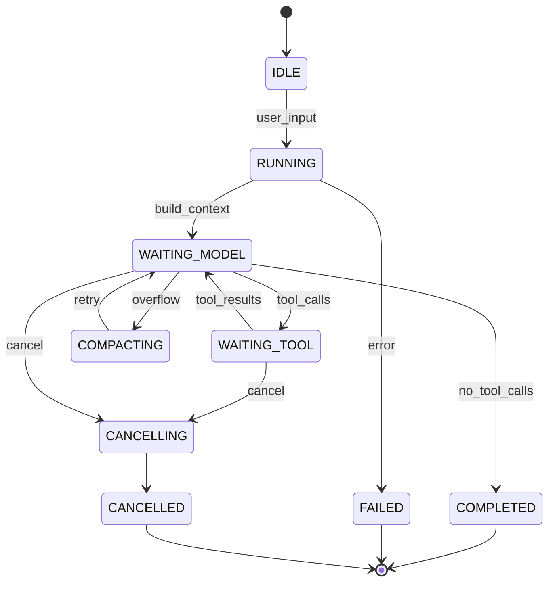
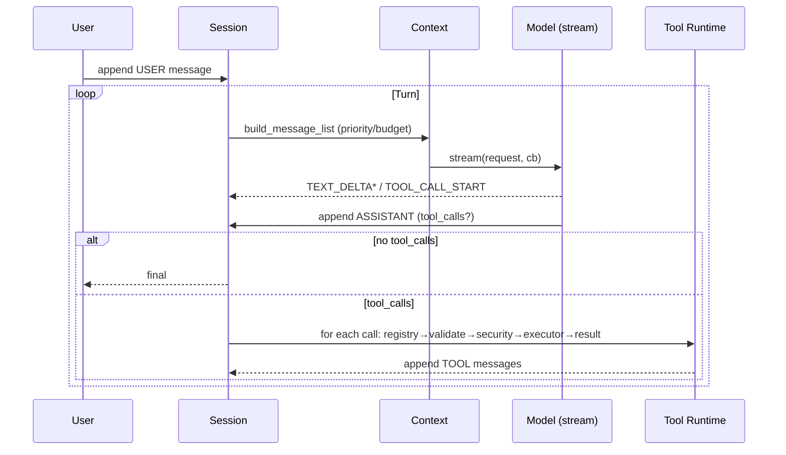

# Agent Loop

## State Machine

## Sequence

## Implementation

`aegis_agent_loop_t {session, model, tools, system_prompt, token, state, lock}`

- `build_context_messages()` — session messages + system prompt (no `char*` concatenation)
- `aegis_model_stream` — mock chunked `TEXT_DELTA`, real provider will emit `TOOL_CALL_*`
- Cancellation: `token` checked before each phase, `WAITING_* → CANCELLING`
- No callback under `lock`: `set_state` is lock-protected, `stream_cb` is lock-free.

## Errors

`CANCELLED → CANCELLED`, `TIMEOUT → FAILED`, `CONTEXT_OVERFLOW → COMPACTING → retry`.
